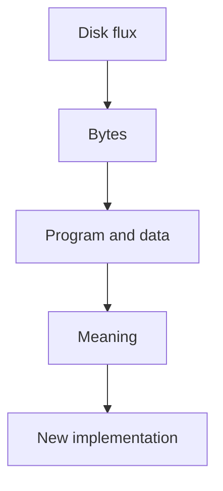
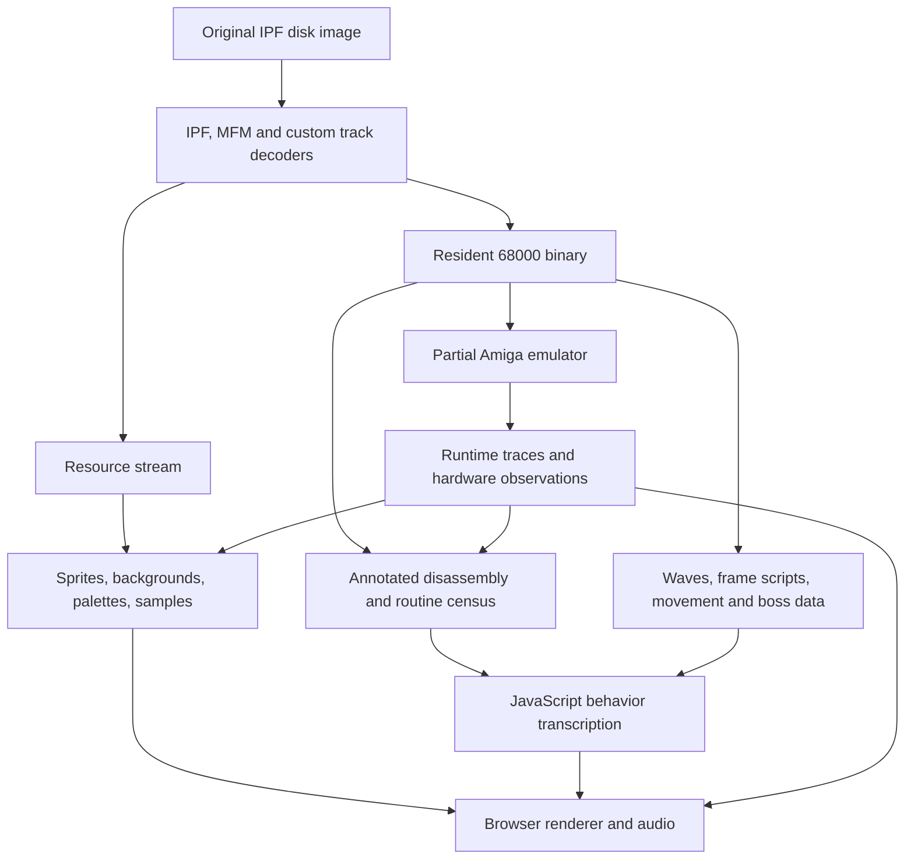
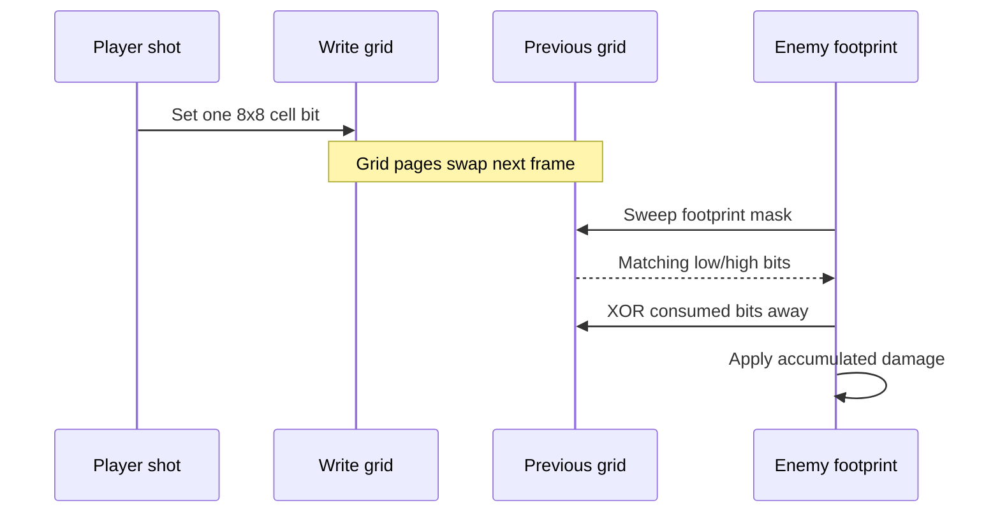

# Rebuilding Saint Dragon from a 1990 Amiga Disk

## A technical postmortem of an Amiga-to-HTML/JavaScript port

This document explains what we built,
how we recovered it from a copy-protected disk image and an unlabelled 68000
binary, what went well, what went badly, and what the project taught us about
reverse engineering, observability, validation, and working with unfamiliar
systems.

The intended audience is technical, but not necessarily from games or retro
computing. In particular, it assumes no prior knowledge of the Commodore Amiga,
Motorola 68000 assembly, planar graphics, floppy encoding, or 1990s game data
formats. A glossary at the end provides quick definitions of the Amiga-specific
terms used along the way.

---

## Executive summary

We rebuilt the Amiga version of **Saint Dragon** as a browser game.

This was not a remake based on screenshots, and it was not an emulator wrapped
in a web page. The final game is a native HTML/JavaScript implementation whose
assets and behavior were recovered from the original disk and executable:

- decode the preservation-grade floppy image, which retains physical track and
  copy-protection details rather than only ordinary sector contents;
- reconstruct and validate the original tracks;
- extract the resident 68000 program;
- disassemble and classify every routine;
- reverse engineer the resource, graphics, animation, wave, collision, player,
  boss, and audio systems;
- export structured assets;
- transcribe the game logic into a coroutine-based JavaScript engine;
- continuously compare the result with the original running in a purpose-built
  partial Amiga emulator.

The final recovery includes:

| Recovered component | Result |
|---|---:|
| Disk tracks validated with the game's checksum | 82 / 82 |
| Disk resources decoded | 85 / 85 |
| Sprite objects | 685 |
| Stage backdrops | 5 |
| Scrolling strips | 5 |
| Edge-fringe graphics | 2 |
| Palettes | 10 |
| Music tracks | 2 |
| Sound effects | 17 |
| Wave records resolved | 602 / 602 |
| Distinct wave dispatch targets | 139 |
| Motion handlers transcribed | 41 / 41 |
| Resident routines classified | 538 / 538 |
| Static call sites covered | 2,891 / 2,891 |
| Playable stages and bosses | 5 / 5 |

The result includes the intro, title, five stages, bosses, player movement and
weapons, collisions, music and effects, death and checkpoint flow, ending,
HUD, high scores, keyboard and touch controls, and the original post-boss
presentation sequences.

The most important methodological decision was made after an early failure:

> Runtime pixels are useful evidence, but they are not a complete specification.
> Disk data and executable behavior must remain the source of truth.

That decision shaped the rest of the project.

---

## First: what machine are we talking about?

### The Amiga in one page

The Commodore Amiga was a family of personal computers introduced in 1985. It
combined a Motorola 68000-family CPU with custom chips designed for graphics,
audio, and memory movement. That division of labor matters: a large part of an
Amiga game is not just CPU instructions. It is CPU code programming specialist
hardware.

The original Saint Dragon port studied here was released in 1990 for the
floppy-based Amiga generation. It predates the **Amiga CD32**, a later CD-based
console released in 1993. The CD32 inherited much of the Amiga architecture,
but it is not the target of this reconstruction.

The important components are:

| Component | Role | Modern analogy |
|---|---|---|
| Motorola 68000 | Runs the game code | CPU |
| Agnus | Coordinates memory access and DMA | memory/display controller |
| Blitter | Copies and combines rectangular bitmaps | simple 2D accelerator |
| Copper | Executes a tiny display-synchronized instruction list | scanline command processor |
| Denise | Turns bitplanes and sprites into video | display pipeline |
| Paula | Four-channel sampled audio, disk DMA, interrupts | audio/DMA peripheral |
| CIA chips | Timers, keyboard, joystick, floppy control | peripheral controllers |

All of these share memory and communicate through memory-mapped registers.
Addresses around `$dff000`, for example, refer to Amiga custom-chip registers,
not ordinary RAM.

### Why there was no source code

The original disk contains compiled machine code and packed resources, not C
source, assembler source, symbols, comments, build scripts, or original asset
files. Names such as `stage5DragonExit` were our annotations: we created them
after working out what an anonymous address such as `$0dbd8` did.

The reverse-engineering problem was therefore:



Each arrow needed its own evidence and validation.

---

## What "port" means in this project

There were three possible strategies.

### 1. Run the original binary in an emulator

This gives high fidelity quickly once the emulator works, but the browser is
still running the old game indirectly. It is difficult to inspect, modify, or
integrate individual systems.

### 2. Recreate the game by observation

Play the original, capture screenshots, redraw the art, and imitate the motion.
This is common for remakes, but it has a severe coverage problem. Anything not
seen during capture is missing, and a plausible visual imitation can preserve
the wrong underlying rules.

### 3. Recover the specification and reimplement it

Decode static resources and translate the original routines into a modern
engine. This was the chosen final approach.

We still built a partial emulator, but used it as a **laboratory instrument**:
to run the original, inspect hardware state, validate static extraction, and
capture the original audio driver's hardware commands. The shipped game logic
does not execute the original 68000 binary.



---

## Phase 1: opening the disk

### The input was an IPF, not a normal disk image

An ADF is usually a sector-level image of an Amiga disk. It is convenient, but
it cannot represent every copy-protection trick. The project started from an
**IPF**: a preservation format that can describe the lower-level layout and
timing characteristics of a floppy track.

The decoder had to understand:

1. IPF chunks such as `CAPS`, `INFO`, `IMGE`, and `DATA`;
2. stream elements describing magnetic transitions;
3. Amiga MFM encoding;
4. the game's custom track framing and checksum;
5. the logical byte stream above that track format.

### What is MFM?

Floppy drives do not store byte values directly. They store magnetic
transitions. **Modified Frequency Modulation** encodes data bits together with
clock information while preventing transition patterns that the hardware
cannot reliably read.

The Amiga often stores odd and even data bits separately and interleaves them
during decode. The disk tools reconstructed that bit-level representation
before the game-specific track decoder could see useful bytes.

### Early failures

- Walking `DATA` chunks by their header length found only one chunk instead of
  168 because the following stream payload was not counted in that length.
- The stream header's `sizewidth` and `type` fields were initially reversed.
- A two-byte section signature was incorrectly included in copied payload data,
  injecting junk every 6,240 bytes.
- The second stage of CopyLock depended on byte timing and was not solved. It
  was irrelevant once cracked builds were shown to contain identical resources.

### The decisive check

All **82 tracks passed the original game's own checksum**.

This is much stronger than "our decoder accepts its own output." The consumer
of the format - the original game - independently accepted the reconstruction.

---

## Phase 2: building an emulator as a microscope

We implemented enough of an Amiga to boot and observe the game:

- a Motorola 68000 interpreter;
- memory and bus behavior;
- Copper display lists;
- bitplane video;
- the Blitter;
- CIA timing and input;
- disk DMA and synchronization;
- Paula audio DMA and interrupts.

This was never intended to become the final product. Its value was
observability. It could answer questions such as:

- Which buffer is the display reading on this scanline?
- What exact sample pointer, length, period, and volume did the audio driver
  write this frame?
- Which memory changed during a particular blit?
- Does a statically extracted object exactly match the object loaded by the
  original resource code?

### Emulator bugs with disproportionate effects

| Bug | Symptom | Root cause |
|---|---|---|
| Odd Blitter pointers | corruption after roughly 227,000 blits | pointers are word-aligned and must be masked |
| Treating `ILLEGAL` as a halt | protection path stopped | the game used exception vector 4 as control flow |
| Inverted `/RDY` | incorrect disk behavior | the signal is active low |
| Instant disk DMA | timeout loops behaved incorrectly | the original wait loop expected time to pass |
| Ignored `DSKSYNC` | CopyLock failed | synchronization word `$8914` mattered bit by bit |
| Missing audio interrupts | one-shot samples repeated forever | playback completion never invoked the driver's IRQ |

The interesting pattern is that several bugs appeared far away from their
cause. A pointer-alignment mistake survived hundreds of thousands of operations
before corrupting visible state. That is familiar to anyone debugging a long
ML training run whose first invalid value appears long after the bad update.

---

## Phase 3: the first graphics approach failed

The first extraction strategy captured graphics at runtime:

- intercept sprite and object blits;
- snapshot playfield memory between terrain and object rendering;
- assemble an atlas from what the emulator happened to see.

It looked productive at first. It was also fundamentally incomplete.

The captured backgrounds contained enemies, the player, and `DEMONSTRATION`
text. Some objects were partial. Parallax was missing. One sprite labelled as
the player was actually an enemy.

The problem was not merely a buggy capture implementation. Runtime capture has
a sampling bias: it can only recover states visited by the run. Rare animation
frames, alternate routes, bosses, hidden objects, and conditional variants are
missing unless the exact event occurs.

This was the project's largest course correction. Roughly a third of the early
work was discarded and archived.

The replacement rule was simple:

> Extract assets from the resource format. Use runtime captures only to verify
> the extraction.

For a machine-learning audience, this is the difference between treating a
sampled dataset as the full generative process and recovering the process that
produced the samples.

---

## Phase 4: decoding the resource system

The key routine at `$2e78` resolves a packed directory entry:

```text
id   = (entry >> 23) & 0x1ff
type = (entry >> 21) & 3
size =  entry & 0x3ffff
```

Resource offsets accumulate through the disk stream. Dividing by `$1600`
(5,632 bytes) gives a track and an offset within that track. Empty directory
entries are holes, not terminators.

Two resource types mattered most:

- type 0: raw;
- type 2: custom RLE compression.

Every one of the 85 resources decompressed to the exact size declared in its
own header. This produced an **85/85 structural validation** of both directory
walking and decompression.

Then 205 resources already loaded by the emulator were compared byte-for-byte
with the static extraction: **205/205 matched**. Static extraction also found
many objects the runtime capture had never encountered.

### The graphics object header

The routine at `$03660` constructs an in-memory object from a ten-byte header:

```text
+2   width in pixels
+3   height
+4   signed horizontal hotspot (the image's alignment reference point)
+5   vertical hotspot
+6   transparent color index
+7   flags
+8   horizontal collision half-extent
+9   vertical collision half-extent
```

The pixels are planar: instead of storing a color index for each pixel, the
Amiga stores one bitmap per bit of the index. Four bitplanes can represent 16
colors. Reconstructing one pixel means reading the corresponding bit from each
plane and combining them.

The transparency mask is generated at load time. It is not stored after the
pixels. The mask generator compares the planar color against the object's key,
so transparent color is not necessarily palette index zero.

### Chained objects: one of the biggest discoveries

Large artwork is split into multiple records. Header flag bit 0 means "the next
record continues this object." All pieces share an anchor and use different
hotspots.

The packed handle is:

```text
handle = (gameObjectIndex << 9) | resourceId
```

The subtle part is that `gameObjectIndex` counts **chain heads**, not atlas
records. A three-slice chain counts as one game object. Indexing the flat atlas
instead lands in the middle of later chains.

This affected 30 resources and caused many apparently unrelated wrong sprites.
The local symptom might be "the bush is wrong," but the root cause was global:
the coordinate system of the asset index was wrong.

This is analogous to confusing row indices with sequence indices in a packed
dataset: all values can be valid while referring to the wrong semantic unit.

---

## Phase 5: turning anonymous machine code into a specification

### A short 68000 primer

The Motorola 68000 is a big-endian 16/32-bit processor with:

- data registers `d0`-`d7`;
- address registers `a0`-`a7`;
- `a7` as the stack pointer;
- byte, word (16-bit), and long (32-bit) operations;
- rich addressing modes, including offsets from an address register and
  PC-relative calls.

Typical code in this game looks like:

```asm
move.w  #$1f40,$36(a5)   ; write 8000 HP into the current object
move.w  #$fa,$0e(a5)     ; x = 250
lea     $ca9c(pc),a0     ; address of a child routine
bsr     $80fe            ; spawn that routine
```

Through repeated use, two registers became architectural anchors:

- `a5` points to the current object;
- `a6` points to the global game state at `$114ec`.

An expression such as `$36(a5)` is therefore a field access, not an arbitrary
memory read. Recovering the object layout turned raw assembly into something
close to decompiled object-oriented code.

### The object model

| Offset | Meaning |
|---|---|
| `$0e/$12` | x/y position, originally 16.16 fixed point: 16 integer and 16 fractional bits |
| `$16/$1a` | x/y velocity |
| `$1e/$22` | x/y acceleration |
| `$26` | speed |
| `$28/$29` | heading, with the angle in the low byte |
| `$2a` | draw depth |
| `$2e` | score award |
| `$30` | current sprite handle |
| `$32/$34` | collision half-extents |
| `$36` | hit points |
| `$38` | horizontal/vertical mirror flags |
| `$44/$48/$4c/$54/$58` | collision and damage callbacks |
| `$50` | offscreen/culling handler state |
| `$5c` | owner |
| `$60` | one retained child |
| `$76` | frame-script synchronization flag |
| `$92/$94/$96` | routine-specific scratch state |

The last row was dangerous. `$92` has no universal meaning. Depending on the
routine it may be a sprite handle, a bank selector, a counter, a movement
variant, or a routine address. Assigning one global semantic label to a reused
scratch field caused repeated mistakes.

### Coroutines in 1990, generators in JavaScript

The original game gives each active object its own stack and switches between
them through `$06bea`. Enemy routines read naturally as sequential scripts:

1. wait until the correct scroll position;
2. enter the screen;
3. move for 40 frames;
4. fire;
5. change velocity;
6. repeat or terminate.

JavaScript generator functions were therefore a natural translation:

```js
function* enemy(o, world) {
  yield* entryGate(o, world, o.trigger);
  o.vx = -1;
  for (let frame = 0; frame < 40; frame++) yield;
  world.spawnProjectile(o);
  o.vy = 1;
  for (;;) yield;
}
```

The browser engine advances every live generator once per 50 Hz simulation
tick. This preserves the shape of the original code instead of converting every
routine into a large explicit state machine.

### Full routine census

The custom disassembler and census eventually classified **538 of 538 real
routines and all 2,891 call sites**.

Getting to 100% required both reading code and correcting the candidate set.
Thirty-nine apparent call targets outside those final 538 routines were actually:

- odd addresses, which a 68000 cannot execute as instruction targets;
- wave-script bytes that happened to resemble branch opcodes;
- printable screen text embedded between routines;
- sample or disk-buffer data beyond the resident program.

These exclusions were recorded with reasons. They were not silently removed to
make the percentage look better.

The generated [annotated disassembly](build/alt/disassembly.asm) contains 603
labelled blocks, call annotations, and explicit data regions. It became the
project's most important navigational artifact.

---

## Phase 6: discovering the game architecture

### Wave timing was data after all

For much of the project, spawn timing looked like the largest threat to a native
port. More than one hundred spawn calls existed, but they were all inside enemy
routines and therefore had no obvious root.

Each stage has a **wave script**, meaning a list of six-byte **wave records**.
The root was a cursor at `$c82(a6)` walking those records:

```text
+0  signed handler offset
+2  scroll-distance trigger
+4  spawn parameter
```

The trigger is compared with world scroll, not elapsed frames. This means stage
length depends on progression speed.

| Stage | Records | Last trigger |
|---|---:|---:|
| 1 | 70 | 6,610 |
| 2 | 89 | 7,084 |
| 3 | 137 | 10,720 |
| 4 | 204 | 12,162 |
| 5 | 102 | 7,208 |

Across the game there are **602 records**. Some spawn enemies, some spawn
formations or invisible carriers, and some are section/checkpoint markers.

The phrase "there is no data-shaped representation" had been an overconfident
statement about the search, not a property of the game. The data was present;
we had not found the cursor that interpreted it.

### Shared primitives, small behaviors

Most enemy routines are short because they compose shared operations:

- acquire a graphics resource;
- wait at an entry gate;
- move until visible;
- attach a frame script;
- wait N frames;
- set velocity from an angle;
- terrain-lock to scrolling;
- spawn or retain a child;
- fire a projectile;
- terminate and release links.

This is why translating the entire game was feasible. The binary contained many
behaviors, but they were programs over a compact vocabulary.

### Inline data hidden inside code

The frame-script routine `$7c38` pops its return address and interprets the words
immediately after the call as animation data. A linear disassembler sees those
words as nonsense instructions. The nonsense was itself evidence: operands
looked like valid sprite handles.

The recovered script VM supports frame holds, loop points, rewind, stop, calls,
and synchronization flags. Similar inline structures encoded boss dances and
movement paths.

This is a recurring reverse-engineering lesson: the code/data boundary is a
runtime convention, not a guarantee provided by the file.

---

## Phase 7: graphics and display reconstruction

### The Amiga screen was not a modern framebuffer

The game builds its display from three vertical bands:

1. ceiling;
2. scrolling backdrop;
3. ground.

Their heights sum to exactly **182 pixels** in every stage. Stages 2, 3, and 4
reuse the same strip resource for ceiling and ground, mirrored as needed.

| Stage | Ceiling | Backdrop | Ground |
|---|---:|---:|---:|
| 1 | 1 | 161 | 20 |
| 2 | 24 | 134 | 24 |
| 3 | 24 | 134 | 24 |
| 4 | 16 | 150 | 16 |
| 5 | 1 | 165 | 16 |

The model was independently supported by:

- the stage descriptor table;
- the scroll updater;
- the Copper-list builder;
- display allocation;
- the routine that offers each object to all three clipped bands.

This was an important style of proof: multiple independent code paths implied
the same structure.

### Copper and Blitter

The **Copper** runs a tiny display-synchronized program. It can wait for a
scanline and change display registers while the beam is moving down the screen.
The game uses it to swap bitplane pointers and scrolling parameters between
screen regions.

The **Blitter** copies and combines rectangular regions of memory. A "cookie
cut" is mask-based blitting: it combines source pixels, a transparency mask,
and destination pixels so an object can be drawn without replacing transparent
areas.

The backgrounds are assembled from repeating vertical slices. Two parallax
layers move at different rates, while the HUD remains static.

### Why screenshots initially showed noise

The game rewrites scrolling buffers during the frame. A memory snapshot taken
at the top of the frame did not necessarily match the buffer and offset being
read later by the display.

Capturing memory at the moment the emulated display consumed it fixed the
background and produced the correct live palette.

Again, the problem was not the data. The instrument observed the right bytes at
the wrong time.

### Palette recovery

An early palette address was wrong for weeks. It could have been rejected
immediately because Amiga color registers use 12-bit RGB, and every candidate
word at that address exceeded `$0fff`.

The final method searched memory for a known live palette captured from the
display hardware. This located the real table and led to ten validated palettes.
The title palette required waiting until a fade had completed.

---

## Phase 8: collision, player, and bosses

### Shot collision is a spatial bit grid

The original does not test every player bullet against every enemy box.
Instead, it maintains two 256-byte pages representing a 64 x 32 grid of 8 x 8
cells over a 512 x 256 coordinate space.

Each frame:

1. flip to a fresh page;
2. player shots stamp bits into the write page;
3. enemies sweep a footprint over the previous page;
4. matching bits are XOR-cleared as they are consumed;
5. accumulated low/high-grid damage is passed to the enemy's handler.



Consequences emerge from the representation:

- hit positions are quantized to 8-pixel cells;
- one bit consumed by one enemy cannot hit another enemy;
- indestructible scenery can consume shots without taking damage;
- collision behavior depends on whether a live shot handler is installed, not
  merely on whether an object can touch the player.

This is closer to a hand-built spatial hash than conventional per-object
collision detection.

### The player dragon

The player's movement is digital and inertia-free. Each frame clears velocity
and rebuilds it from a 16-entry heading table. Releasing input stops movement
immediately.

The body follows a 64-entry ring buffer. Four body segments and a rotating tail
read positions at fixed negative offsets behind the head. A sign error in those
offsets silently inverted the chain.

The weapon spread is particularly elegant. Higher spread levels do not emit all
shots from the head. They launch from offsets along the dragon's trail:

```text
0, then +/-2, +/-4, +/-6, +/-8 trail slots
```

The fan therefore emerges along the dragon's body.

### Bosses as distributed programs

Bosses were not single sprites with one update method.

- Stage 1 is four retained objects following a 13-waypoint path.
- Stage 2 has a core and six mirrored shell layers that enter from offscreen,
  close around the core, and open for timed attack windows.
- Stage 3 combines a tube, invulnerable animated sections, destructible orbiters,
  chained attacks, and several lethal successor forms.
- Stage 4 has a partner running the same script with one state field inverted;
  one lays mines while the other fires.
- Stage 5 freezes ordinary world motion and runs twelve independently scripted
  segments with flicker, vulnerable windows, and repeating dances.

The stage-5 dance extractor recognized a closed instruction vocabulary and
parsed all twelve scripts with no unrecognized instructions. That was strong
evidence that the parser covered this format, but not proof that our semantic
interpretation of every operation or unrelated boss behavior was correct.

---

## Phase 9: audio - the longest and hardest subsystem

### Paula audio in practical terms

Paula exposes four DMA audio channels. Each channel has registers for:

- sample start address;
- sample length;
- playback period, which controls pitch;
- volume.

The hardware has fixed stereo placement:

- channels 0 and 3 on the left;
- channels 1 and 2 on the right.

It plays 8-bit sample data directly. The game layers its own voice allocator,
priority system, envelopes, sequencing, and synthesized instruments above those
registers.

### The initial model was wrong

Sound ids 85-88 were first labelled as tunes. They are actually instruments:
graphs of synthesis operators driven by 68000 code. Because the graphs parsed
perfectly, it was tempting to conclude there was no separate song data.

The user knew the game had a repeating stage tune. Further analysis found:

- a full sequencer at `$10d34`;
- 16-bit musical events;
- a duration table for whole, half, quarter, and eighth notes;
- nested loop operations;
- a song table selected by global state.

### Three reimplementations failed

Attempts to synthesize the score using hand-written approximations sounded
wrong. The instruments were not static waveforms. They were executable 68000
programs that swept sample pointers and envelopes over time.

The successful solution changed the abstraction boundary:

> Run the original audio driver and record what it tells Paula to do.

The emulator logged writes to sample address, length, period, volume, and DMA
control. The browser replays that register stream through a software Paula.

This preserved the original driver's decisions without requiring the browser
to emulate the entire game.

### Audio defects and what they taught us

| Observation | Cause | Correction |
|---|---|---|
| One-shot effect repeats forever | no audio completion interrupt | implement DMA IRQ behavior |
| Music stops around 16 seconds | death fade was captured and never reset | suppress that run-specific fade |
| Explosions leak into music | effects muted after capture with stale masks | mute effects at the original source state |
| Playback sounds noisy | point sampling tiny buffers at 48 kHz | linear interpolation and roughly 7 kHz filtering |
| Stereo image is missing | four Paula channels mixed to mono | restore fixed hardware panning |
| Loop misses the beginning | one channel boundary chosen as global loop | use frame 6,746 where all channels realign |
| Boss music missing | only song selector 0 captured | capture selector 1 as well |

The final stage theme lasts **98.3 seconds**, exactly matching an independent
duration computed from the recovered score events. Agreement between unrelated
derivations was one of the project's strongest validations.

---

## Phase 10: the browser implementation

### Engine architecture

The browser port separates concerns:

| File or directory | Responsibility |
|---|---|
| `web/engine/engine.js` | world, objects, scheduler, physics, collision, waves |
| `web/engine/behaviours.js` | enemy, boss, projectile, player, and presentation routines |
| `web/engine/index.html` | renderer and diagnostic harness |
| `web/engine/full.html` | complete route, persistence, audio, mobile controls |
| `web/assets/` | extracted JSON and PNG assets |
| `web/audio/` | captured register streams and sound exports |
| `tools/` | extraction, disassembly, export, audit, and server utilities |
| `emu/` | partial Amiga emulator used for validation |

The simulation runs at a fixed **50 Hz**, matching PAL vertical blank timing.
Rendering is decoupled from the simulation tick.

### Full-game flow

The complete route manages:

- intro and title;
- stage documents 1 through 5;
- persistent score, lives, and weapon state;
- player death and checkpoint restoration;
- boss music transitions;
- post-boss presentation;
- ending and high-score flow;
- desktop keyboard input;
- mobile two-thumb controls;
- optional CRT presentation.

One subtle browser bug skipped stage 4: a completed stage-3 iframe could be
rebound while the replacement iframe was loading, and its stale completion flag
advanced the route again. A `routeLoading` guard made route transitions atomic.

Another subtle bug was HTTP caching. Versioned script URLs did not help if the
browser reused an old HTML file containing old URLs. The fix belonged in the
server: `tools/serve.py` sends `no-store`.

---

## The coolest discoveries

### 1. The complete disassembly became navigable

The raw resident binary became an annotated map of the program: boot, display,
disk, audio, input, object scheduler, waves, enemies, bosses, text, high scores,
and protection code.

The final routine census did more than produce a percentage. It established the
boundary between executable logic and look-alike data, then propagated names
through 2,891 call sites.

This changed reverse engineering from searching a byte ocean into following a
call graph.

### 2. The game already used coroutine architecture

What looks like a modern generator-based entity system was present in the 1990
binary using one stack per object and explicit context switching. The JavaScript
port did not impose generators as a fashionable abstraction; generators matched
the original execution model.

### 3. Wave scheduling was a compact learned-like representation

Hundreds of visible encounters are generated from 602 tiny records plus shared
behavior programs. The data says *when and which routine*; the routine says
*how*. Formations recursively spawn children.

The result resembles a compact programmatic scene generator more than a list of
fully specified enemies.

### 4. The art format encoded semantics, not just pixels

Headers included hotspots, transparent keys, chain flags, draw-path flags, and
collision extents. A sprite atlas without those fields is not the asset. It is
only one projection of the asset.

### 5. Collision used a double-buffered spatial representation

The 8 x 8-cell shot grid avoided bullet/enemy pair iteration and naturally
enforced single-consumer hits. It is an elegant data-oriented solution under
tight 1990 memory and CPU budgets.

### 6. Audio was recovered by moving to the hardware boundary

Three synthesis rewrites failed. Capturing register writes succeeded. Choosing
the right interface to preserve was more important than writing a more detailed
approximation.

### 7. The bosses were choreography, not statistics

Their identity came from timing, attachment, invulnerability, depth, child
ownership, and transitions - not just hit points and sprites. Small visual
details such as stage-3 orbiters entering attached behind the tube required
understanding spawn timing and draw sort order together.

---

## What went well

### Evidence was made executable

The best claims had checks:

- 82 track checksums;
- 85 decompressed lengths;
- 205 byte-identical static/runtime resource comparisons;
- 12/12 boss scripts parsed with no unknown operations;
- 602/602 wave records dispatched;
- 538/538 real routines classified;
- independent 98.3-second audio derivations;
- focused behavior probes for exact frames, coordinates, depths, HP, and effect
  counts.

### The source of truth stayed low-level

Once the runtime-capture approach was rejected, constants were expected to be
traceable to disk data or an assembly address. Visual comparison remained
essential, but it generated questions rather than arbitrary tuning.

### The user feedback loop was extremely effective

Many important corrections began as precise play observations:

- "the music repeats incorrectly";
- "this enemy enters from the wrong side";
- "the boss core is always blocked";
- "the rotating part is attached to the wrong side";
- "this indestructible structure should stop bullets".

The productive workflow was:

1. report a concrete visible or audible mismatch;
2. locate the controlling routine;
3. derive the original behavior;
4. make the smallest change;
5. validate the exact reported property;
6. run broad regressions afterward.

Human familiarity with the original and machine-assisted code search were
complementary. Internal self-consistency alone was repeatedly insufficient.

### The codebase accumulated instruments, not just fixes

Each expensive class of bug led to a reusable audit: field propagation, object
birth/death traces, motion coverage, child routine loops, anchor extraction,
spawn counts, routine census, and browser probes.

The later project moved faster because earlier failures improved observability.

---

## What was hard

### There were several simultaneous coordinate systems

Examples include:

- disk track and byte offsets;
- resident addresses;
- resource ids and packed handles;
- flat atlas indices versus chain-head indices;
- hardware scanline coordinates versus canvas coordinates;
- object anchors versus sprite hotspots;
- band-relative coordinates;
- fixed-point velocities versus pixels per frame;
- depth values whose numerical direction is opposite a naive painter's order.

Many bugs were valid numbers interpreted in the wrong coordinate system.

### Code and data were interleaved

Animation words looked like illegal instructions. Text looked like code targets.
Wave records contained byte patterns that looked like branches. A complete
disassembler had to understand enough program conventions to avoid confidently
disassembling data.

### The original reused fields aggressively

Memory was precious. The same object slot carried unrelated meanings in
different routines. Global naming was tempting and often wrong.

### Timing crossed subsystem boundaries

Entry gates, frame scripts, world freeze, physics integration, rendering,
Blitter timing, audio interrupts, iframe navigation, and browser cache behavior
all introduced temporal state. Sampling one frame too early or at the wrong
pipeline stage could produce a clean but false result.

### Fidelity is often in lifecycle details

The hardest boss bugs were not equations. They were questions such as:

- Is the boss registered before or after its entry coroutine yields?
- Does a child outlive its owner?
- Does an invulnerable object still consume a shot?
- Is an orbiter drawn before or after the tube?
- Does the destroyed final form remain visible during its completion delay?
- Does the player survive the post-boss presentation?

These are ownership and state-transition questions.

---

## What went badly, and why

### 1. Labels assigned by eye became facts

Early labels such as "resource 13 is the dragon," "this field is score," or
"this address is a palette table" propagated into later work. Most facts
derived from code survived. Many labels derived from visual guesses did not.

**Improvement:** every recovered fact should include provenance: routine,
address range, runtime trace, or format invariant.

### 2. Correct facts were applied outside their scope

A rotation table really did control rotation - but only for the tail end, not
every body segment. Ownership cleanup really did release a child - but only one
retained child, not all children.

The dominant error was often not an incorrect derivation. It was an incorrect
claim about where that derivation applied.

**Improvement:** record both meaning and domain. "Table X selects tail-end
frames in routine Y" is safer than "Table X is dragon rotation."

### 3. Measurements failed to distinguish hypotheses

"Zero bytes changed" was compatible with both "nothing was rendered" and "the
same data was rendered again." Object counts were sampled before generators
ran. Dead objects were compacted before an observer inspected them. A test page
retained scroll state from the previous run.

The measurement could be accurate while the conclusion was underdetermined.

**Improvement:** before acting on a measurement, write down at least one rival
hypothesis that would produce the same output and design a discriminating test.

### 4. Aggregate metrics hid behavioral errors

An audit once reported that nearly every enemy "moved." The player correctly
reported that enemy movement was mostly wrong. A constant-velocity object and a
complex oscillator both satisfy `moved === true`.

**Improvement:** measure the property in question: velocity transitions,
turning points, cadence, bounds, or exact state changes. Isolated per-handler
tests beat broad aggregate proxies.

### 5. Reimplementation crossed the wrong boundary

The audio instruments were executable programs. Recreating their apparent
waveforms failed repeatedly. Capturing their hardware outputs worked.

**Improvement:** when the original component is itself a program, consider
preserving its observable protocol rather than approximating its internals.

### 6. Browser caching impersonated code failure

Correct changes appeared not to work because stale HTML loaded stale scripts.
This cost multiple false debugging passes.

**Improvement:** make development serving and versioning part of the verified
toolchain, not an informal shell command.

### 7. Documentation was once damaged by tooling

A write using a platform-default encoding truncated one document and rewrote
another in CP1252. The project was not under version control; recovery was only
possible because the session still contained the text.

**Improvement:** initialize version control on day one, use explicit UTF-8, and
review diffs after automated documentation edits.

### 8. Some fixes became too broad

Late boss corrections demonstrated a classic maintenance risk: a request about
one pair of destructible orbiters accidentally changed adjacent tube parts that
were already correct. The correct follow-up restored the tube and altered only
the orbiters.

**Improvement:** identify the exact object addresses and lifecycle before
editing. Validate untouched neighboring objects as explicit negative tests.

---

## The validation strategy that emerged

The project ended with a layered approach.

### Layer 1: format invariants

- original disk checksums;
- decompressed sizes;
- legal address alignment;
- known palette bit width;
- exact parser consumption.

### Layer 2: static cross-checks

- routine and call-site census;
- extracted fields reaching runtime specs;
- handles resolving to chain heads;
- code-derived anchors matching exported anchors;
- every wave record resolving to a handler.

### Layer 3: isolated behavior tests

- one handler in one controlled world;
- exact spawn count;
- exact velocity sequence;
- exact orbit bounds;
- HP before and after a shot;
- object visibility and depth at selected frames.

### Layer 4: full-stage scheduler tests

- all real wave records fire;
- bosses register before the wave script ends;
- successor forms transfer ownership without one-frame gaps;
- stage completion occurs only after the correct terminal sequence.

### Layer 5: browser verification

- correct hashed assets are loaded;
- the canvas is nonblank;
- navigation does not skip scenes;
- desktop and mobile controls remain usable;
- real rendering order matches the simulated depth relation.

### Layer 6: human comparison

The final oracle for presentation was still a person familiar with the original.
The difference was that a mismatch now triggered code investigation rather than
visual guesswork.

---

## Tools produced by the project

| Tool | Purpose |
|---|---|
| `tools/ipf.py` | parse the IPF container |
| `tools/mfm.py` | decode MFM bitstreams |
| `tools/trackfmt.py` | decode the custom game track format |
| `tools/hunk.py` | read AmigaDOS executable hunks |
| `tools/dis68k.py` | disassemble Motorola 68000 code |
| `tools/census.py` | classify routines and call-site coverage |
| `tools/export_disasm.py` | generate the annotated disassembly |
| `tools/rle.py` | custom resource decompression |
| `tools/objstream.py` | walk object records and chains |
| `tools/export_gfx.py` | export graphics and metadata |
| `tools/export_audio.py` | export audio register streams and effects |
| `tools/export_boss.py` | parse stage-5 boss choreography |
| `tools/extract_anchors.py` | recover band anchors and mirror behavior |
| `tools/check_fields.js` | detect dropped fields and invalid handles |
| `tools/audit_objects.js` | trace object births, motion, drawing, and death |
| `tools/audit_motion.py` | find untranscribed motion routines |
| `tools/audit_children.py` | detect child routines flattened incorrectly |
| `tools/audit_spawns.js` | compare fired records with spawned parents |
| `tools/serve.py` | serve the browser build with `no-store` |
| `tools/bump_version.py` | hash scripts and assets for browser URLs |

The tools are a major output of the work. They preserve not only the final
answer but also the ability to challenge it.

---

## How AI assistance helped, and where it did not

This project was well suited to AI-assisted programming because it contained a
large amount of local, repetitive, evidence-heavy work:

- searching thousands of assembly lines for field writes and call sites;
- comparing sibling routines;
- translating short routines into generator code;
- generating focused runtime probes;
- keeping history and handoff documents synchronized;
- spotting patterns across extracted JSON, JavaScript, and assembly.

AI assistance was most effective when the task had a concrete anchor:

- an address;
- a visibly wrong object;
- a failing assertion;
- a field offset;
- a known frame or coordinate.

It was least reliable when asked to infer broad semantics from appearance or
from a single aggregate measurement. Plausible labels and plausible fixes were
dangerous because the codebase often contained valid-looking neighboring data.

The successful collaboration pattern was not "AI reconstructs the game." It was:

```text
human observation
    -> targeted code search
    -> local hypothesis
    -> smallest implementation
    -> executable check
    -> human visual/audio confirmation
```

The human supplied historical memory, taste, and a strong rejection signal when
something merely looked plausible. The assistant supplied search bandwidth,
translation speed, instrumentation, and persistence across a very large body of
low-level evidence.

---

## What we would do differently next time

### Start with provenance and version control

Every label, extracted constant, and generated artifact should carry its source
address or derivation. The repository should be under version control before
the first experiment.

### Build the routine census earlier

The complete call graph dramatically reduced search time. It should precede
large-scale behavior transcription.

### Separate raw, decoded, interpreted, and presentation data

A clearer pipeline would distinguish:

1. raw disk bytes;
2. decompressed resource bytes;
3. parsed semantic records;
4. browser-ready atlases and JSON;
5. renderer presentation choices.

This makes it harder for a display assumption to contaminate extraction.

### Make trace events first-class from the beginning

Object birth, first draw, state changes, projectile creation, death, and cull
reason should be recorded as events. Sampling a mutable live array is not a
substitute for an event log.

### Define behavior contracts before transcribing families

For each routine family, write the observable contract first:

- entry position and timing;
- velocity/state sequence;
- sprite/animation sequence;
- child count and ownership;
- collision handlers;
- termination condition.

Then translate and test against that contract.

### Preserve negative requirements

Tests should include what must **not** change: an adjacent boss part remains
invulnerable, a tube keeps its original anchor, a scenery object does not hurt
the player, or a retained child survives its owner.

### Choose abstraction boundaries deliberately

Static decoding was right for graphics and wave data. Behavioral transcription
was right for enemies and bosses. Register-stream capture was right for audio.
No single recovery strategy was best for every subsystem.

---

## Glossary

**ADF**  
A convenient sector-level Amiga floppy image. It often cannot preserve unusual
copy-protected track layouts.

**Amiga CD32**  
A CD-based Amiga-derived console released in 1993. Saint Dragon's 1990 Amiga
floppy version predates it and uses the earlier classic Amiga architecture.

**Bitplane**  
A bitmap containing one bit of every pixel's color index. Multiple planes are
combined to produce indexed color.

**Blitter**  
The Amiga's block image transfer hardware. It copies and logically combines
rectangular memory regions.

**Copper**  
A small display-synchronized coprocessor that waits for beam positions and
changes graphics registers during a frame.

**Coroutine**  
A routine that can suspend and resume while keeping local state. The original
used separate stacks; the port uses JavaScript generators.

**DMA**  
Direct Memory Access. Custom hardware reads or writes memory without the CPU
copying every byte.

**Fixed point**  
An integer encoding of a fractional number. In 16.16 format, the high 16 bits
are the integer part and the low 16 bits are the fraction.

**Flux / magnetic transition**  
The physical change in magnetic orientation read from a floppy surface. Disk
formats encode bits through the timing of these transitions.

**Handle**  
A packed game reference combining resource id and object index.

**Hotspot**  
The point inside or around an image aligned to the game object's logical
position. It is not necessarily the image center.

**IPF**  
Interchangeable Preservation Format, designed to preserve original floppy
layout and protection details beyond ordinary sectors.

**MFM**  
Modified Frequency Modulation, a floppy encoding that combines clock and data
constraints into magnetic transition patterns.

**Paula**  
The Amiga custom chip responsible for four-channel sample audio, disk DMA, and
some interrupt handling.

**Planar graphics**  
Pixel data stored as separate bitmaps for each color-index bit rather than one
packed value per pixel.

**RLE**  
Run-Length Encoding, a compression family that represents repeated values as a
value plus a repeat count.

**Resident**  
The main game program loaded into memory and kept there while stages and
resources are streamed.

**Sprite chain**  
Several adjacent graphics records treated as one logical game object.

**Vertical blank / 50 Hz**  
The interval between PAL display frames. The game uses this cadence as its main
simulation clock.

---

## Final takeaway

The completed port is satisfying, but the more reusable result is the method.

We started with a copy-protected disk and no semantic labels. We ended with a
navigable program, structured assets, executable behavioral specifications,
layered validation tools, and a native browser implementation.

The project succeeded when it stopped asking:

> "What would make this look approximately right?"

and consistently asked:

> "What representation did the original use, what code consumed it, and what
> observation would prove that our interpretation is the same?"

That question applies far beyond retro games.